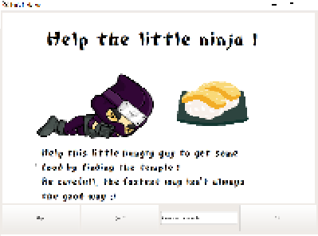
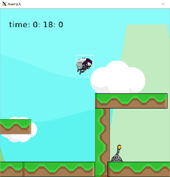

	# Help the ninja ! 

Le but du jeux est de contrôler le petit ninja (à l'aide des flèches du clavier/barre espace) rejoindre le temple afin qu'il puisse retourner au temple. Pour qu'il accède au temple, il va devoir monter sur les plateformes, et enclencher un levier afin de faire apparaître une plateforme permettant de rejoindre le temple.

# Configurations requises
Afin de pouvoir jouer au jeux, vous allez avoir besoin de faire quelques manipulations:
* Lancer l'application graphique comme Xming (Si vous n'en avez pas, voici un lien permettant de l'installer: https://sourceforge.net/projects/xming/)
Ici un lien permettant de configurer votre Xming avec votre environnement de développement: http://wwwens.aero.jussieu.fr/lefrere/master/mni/mni/unix/xming.pdf
* Lancer XMing.
* Télécharger le projet.zip, deziper tout le projet et vérifiez que le fichier texte "scoreboard.txt" est bien dans le dossier /src/.
* Respectez bien l'arborescence de chacun des fichier.cpp/.h ainsi que les images comme dans le fichier .zip
* Il ne vous reste plus qu'à run le code. 
 
Description du projet:  
* Création d'un objet pouvant sauter des obstacles sous forme de vide/barre pour parvenir à une ligne d'arrivée grâce aux commandes clavier:
* Le temps le plus court doit être mémorisé.
* Le jeux doit être composé d'une scène et d'une vue centrée sur le joueur au minimum. 
* Possibilité de rejouer une partie après avoir terminé le niveau
* Projet en solo, à rendre avec un fichier Readme 

Quelques images du rendu:    

Les fonctionnalités:
* Collisions sur toutes les plateformes, ainsi qu'avec le levier mécanique avec changement d'images pour indiquer au joueur qu'il à bien activé le levier.
* Ajout d'une gravité, ainsi que d'une plateforme invisible qui s'active quand on touche le levier
* Récupération du temps au dixième prêt, avec enregitrement d'un pseudo. 
* Possibilité de rejouer à la fin du niveau.
* effets visuels, images, tilesets, background etc.  

Mises à jour futures: 

* Créations d'ennemis, possibilité au personnage de lancer des des objets permettant de tuer les ennemis.
* Ajout de sprites afin de rendre l'animation plus fluide. 
* ajout d'une accélération lorsque le personnage tombe.  
* Ajout de sons pour rendre le jeux plus agréable.

# Auteur: 
Basile GALLOT

# Logiciels utilisés:
* CLion
* Photofiltre

